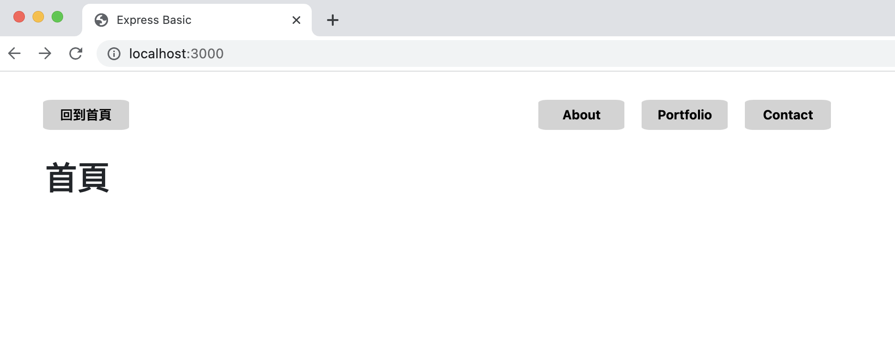

# A22-express_basic



AlphaCamp 學期 2-3 A22 技術驗收:Express 基礎驗收 

## 🎯驗收功能

- 使用 express 製作一個「可啟動的應用程式」
- 正確地設定路由
- 點擊按鈕可正確導連至相對應的網址路徑
- 視覺排版呈現如題

## ✔️開始使用

1. 請先確認有安裝 node.js 與 npm
2. 將專案 clone 到本地
3. 在本地開啟之後，透過終端機進入資料夾，輸入：

   ```bash
   npm install
   ```

4. 安裝完畢後，繼續輸入：

   ```bash
   npm run start
   ```

5. 若看見此行訊息則代表順利運行

   ```bash
   Express is listening on localhost:3000
   ```

6. 打開瀏覽器，並輸入 localhost:3000 進入首頁

## 📌開發工具

- Node.js v14.16.0
- Express 4.16.4
- Express-Handlebars @3.0.0
